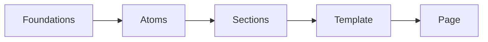

# ARQUITECTURA DEL PROYECTO MEP

## 📋 Índice
- [Visión General](#visión-general)
- [Estructura del Proyecto](#estructura-del-proyecto)
- [Flujo de Desarrollo](#flujo-de-desarrollo)
- [Sistema de Templates](#sistema-de-templates)
- [Patrones de Código](#patrones-de-código)
- [Escalabilidad](#escalabilidad)

## 🏗️ Visión General

### Filosofía de Diseño
El proyecto MEP está construido siguiendo los principios de **Atomic Design** y **Component-Driven Development**, organizando el código en capas incrementales de complejidad:

```
Foundations → Atoms → Molecules → Organisms → Templates → Pages
```

### Principios Arquitectónicos

1. **Separation of Concerns**: Cada capa tiene responsabilidades específicas
2. **Reusabilidad**: Componentes diseñados para múltiples contextos
3. **Escalabilidad**: Estructura preparada para crecer sin refactorización
4. **Consistency**: Sistema de design tokens para consistencia visual
5. **Developer Experience**: Herramientas y patrones que facilitan el desarrollo

---

## 📁 Estructura del Proyecto

### Jerarquía Completa
```
MepWebFront/
├── public/                          # Assets estáticos
├── src/
│   ├── design-system/               # 🎨 Sistema de Diseño
│   │   ├── foundations/             # Tokens base y utilidades
│   │   │   ├── colors.js           # Paleta de colores
│   │   │   ├── semantic-colors.js  # Tokens semánticos
│   │   │   ├── typography.js       # Sistema tipográfico
│   │   │   ├── layout.js           # Spacing, grids, containers
│   │   │   ├── shapes.js           # Shapes decorativos
│   │   │   ├── theme-hooks.js      # React hooks para tema
│   │   │   ├── responsive-classes.js # Sistema responsive
│   │   │   ├── icons/              # Sistema de iconografía
│   │   │   ├── img/                # Imágenes del sistema
│   │   │   └── video/              # Videos del sistema
│   │   └── atoms/                   # ⚛️ Componentes básicos
│   │       ├── Badge/              # Badges (texto/número)
│   │       ├── Button/             # Botones (4 variantes)
│   │       ├── Card/               # Tarjetas (vertical/horizontal)
│   │       ├── Footer/             # Footer de la aplicación
│   │       ├── Header/             # Header con navegación
│   │       └── sections/           # Secciones de página
│   │           ├── HeroSection.jsx
│   │           ├── StatsSection.jsx
│   │           ├── ProjectsSection.jsx
│   │           ├── BlogSection.jsx
│   │           └── EmptySpace.jsx
│   ├── PageTemplate.jsx            # 📄 Template base para páginas
│   ├── pages/                       # 📄 Páginas de la aplicación
│   │   ├── Home.jsx                # Home original
│   │   ├── Home_New.jsx            # Home refactorizado
│   │   └── ExamplePage.jsx         # Ejemplo de uso de templates
│   ├── App.jsx                      # Componente raíz
│   └── main.jsx                     # Entry point
├── package.json                     # Dependencias y scripts
└── vite.config.js                   # Configuración de Vite
```

### Responsabilidades por Capa

#### 🏛️ Foundations
- **Propósito**: Tokens de diseño, utilidades base, configuraciones globales
- **Contenido**: Colores, tipografía, spacing, responsive utilities
- **Principio**: "Single source of truth" para todos los valores de diseño

#### ⚛️ Atoms
- **Propósito**: Componentes UI básicos reutilizables
- **Contenido**: Botones, badges, cards, inputs, iconos
- **Principio**: Componentes puros sin lógica de negocio

#### 📄 Templates & Pages
- **Propósito**: Estructura de páginas y componentes de página específicos
- **Contenido**: PageTemplate, layouts de página, páginas completas
- **Principio**: Composición de atoms para crear interfaces completas

---

## 🔄 Flujo de Desarrollo

### 1. Desarrollo de Nuevas Features

#### Paso 1: Análisis de Requerimientos
```
1. ¿Es un componente reutilizable? → Atom
2. ¿Es una sección de página? → Section (Atom especializado)
3. ¿Es una página completa? → Page using Template
4. ¿Requiere nuevos tokens? → Actualizar Foundations
```

#### Paso 2: Implementación


#### Paso 3: Integration Testing
```
1. Verificar integración con sistema de tokens
2. Probar responsive behavior
3. Validar accesibilidad
4. Comprobar performance
```

### 2. Creación de Nueva Página

#### Flujo Estándar
```jsx
// 1. Definir contenido y estructura
const pageContent = {
  hero: { title: "...", subtitle: "..." },
  stats: [...],
  projects: [...],
  blog: [...]
};

// 2. Componer usando Template + Sections
import { PageTemplate } from '../PageTemplate.jsx';
import { HeroSection, StatsSection } from '../design-system/atoms/sections/';

const NuevaPagina = () => (
  <PageTemplate>
    <HeroSection {...pageContent.hero} />
    <StatsSection {...pageContent.stats} />
    {/* más secciones... */}
  </PageTemplate>
);
```

#### Tiempo de Desarrollo Estimado
- **Página simple**: 30-60 minutos
- **Página compleja**: 2-4 horas
- **Página con nuevos components**: 1-2 días

### 3. Modificación de Componentes Existentes

#### Guidelines
```
1. ¿Afecta a otros componentes? → Revisar todos los usos
2. ¿Cambia la API del componente? → Version bump
3. ¿Modifica tokens base? → Impacto global, revisar todo
4. ¿Solo styling? → Safe change, test visual
```

---

## 🎨 Sistema de Templates

### PageTemplate Base

#### Características
- **Auto-responsive**: Inyecta estilos responsive automáticamente
- **Layout consistent**: Containers y spacing estandarizados
- **SEO ready**: Meta tags y estructura semántica
- **Performance optimized**: Lazy loading y code splitting

#### Estructura HTML Generada
```html
<div class="page-container">
  <div class="content-wrapper">
    <!-- Contenido de la página -->
  </div>
</div>

<!-- CSS responsive inyectado automáticamente -->
<style>
  .page-container { /* estilos mobile */ }
  @media (min-width: 768px) {
    .page-container { /* estilos desktop */ }
  }
</style>
```

### Section Components

#### Tipos de Secciones
1. **HeroSection**: Headers de página con video/imagen background
2. **StatsSection**: Métricas y números importantes
3. **ProjectsSection**: Showcase de proyectos con cards
4. **BlogSection**: Artículos y noticias
5. **EmptySpace**: Espaciado configurable entre secciones

#### API Unificada
```jsx
// Todas las secciones siguen el mismo patrón
<SeccionTipo
  title="Título opcional"
  description="Descripción opcional"
  data={contenidoEspecifico}
  customStyles={estilosPersonalizados}
  onAction={callback}
/>
```

---

## 🧩 Patrones de Código

### 1. Component Pattern

#### Estructura Base
```jsx
import React from 'react';
import { useSemanticTokens } from '../foundations/theme-hooks.js';

const ComponenteEjemplo = ({ 
  variant = 'primary',
  size = 'md',
  children,
  ...props 
}) => {
  const colors = useSemanticTokens();
  
  // Lógica del componente
  const computedStyles = {
    base: { /* estilos base */ },
    variants: {
      primary: { /* variante primary */ },
      secondary: { /* variante secondary */ }
    }
  };

  return (
    <div 
      style={{
        ...computedStyles.base,
        ...computedStyles.variants[variant]
      }}
      {...props}
    >
      {children}
    </div>
  );
};

export default ComponenteEjemplo;
```

### 2. Token Usage Pattern

#### Acceso a Tokens Semánticos
```jsx
// Hook para acceder a todos los tokens
const colors = useSemanticTokens();

// Uso en componentes
const styles = {
  color: colors.content.text,
  backgroundColor: colors.surface.background,
  borderColor: colors.border.primary
};
```

#### Direct Token Import
```jsx
// Para tokens estáticos
import { textStyles, spacing } from '../foundations/';

const styles = {
  ...textStyles.bodyMedium,
  marginBottom: spacing.vw.md
};
```

### 3. Responsive Pattern

#### Auto-injection
```jsx
import { generateResponsiveStyles } from '../foundations/layout.js';

// CSS automático inyectado
const cssString = generateResponsiveStyles('mi-componente',
  { /* mobile styles */ },
  { /* desktop styles */ }
);
```

#### Manual Responsive
```jsx
const responsiveStyles = {
  mobile: {
    padding: spacing.base.sm,
    fontSize: '14px'
  },
  desktop: {
    padding: spacing.vw.md,
    fontSize: 'clamp(14px, 1vw, 16px)'
  }
};
```

### 4. State Management Pattern

#### Local State
```jsx
const [isOpen, setIsOpen] = useState(false);
const [loading, setLoading] = useState(false);
```

#### Context Pattern (para state global)
```jsx
// Crear contexto
const AppContext = createContext();

// Usar en componentes
const { user, theme, updateTheme } = useContext(AppContext);
```

---

## 📈 Escalabilidad

### Agregar Nuevos Componentes

#### Checklist de Escalabilidad
```
□ ¿Usa tokens semánticos?
□ ¿Sigue naming conventions?
□ ¿Está documentado?
□ ¿Tiene props interface clara?
□ ¿Es responsive?
□ ¿Exportado correctamente?
□ ¿Incluido en index.js?
```

### Nuevas Páginas

#### Template Usage
```jsx
// Página nueva siguiendo el patrón
import { PageTemplate } from '../PageTemplate.jsx';
import { 
  HeroSection, 
  CustomSection 
} from '../design-system/atoms/sections/';

const PaginaNueva = () => (
  <PageTemplate>
    <HeroSection {...heroData} />
    <CustomSection {...customData} />
  </PageTemplate>
);
```

### Nuevos Tokens

#### Agregar Token de Color
```javascript
// 1. colors.js - Agregar color base
export const colors = {
  // existentes...
  newColor: {
    50: '#...',
    500: '#...',
    900: '#...'
  }
};

// 2. semantic-colors.js - Mapear semánticamente  
export const semanticColors = {
  // existentes...
  newContext: {
    primary: colors.newColor[500],
    secondary: colors.newColor[300]
  }
};
```

### Performance Considerations

#### Bundle Size
- **Code splitting**: Páginas separadas por chunks
- **Lazy loading**: Componentes cargados on-demand
- **Tree shaking**: Solo imports usados

#### Runtime Performance
- **React.memo**: Para atoms puros
- **useMemo**: Para cálculos costosos
- **useCallback**: Para event handlers estables

---

## 🔧 Tooling y Development

### Scripts Disponibles
```json
{
  "dev": "vite",                    // Desarrollo local
  "build": "vite build",            // Build de producción
  "preview": "vite preview",        // Preview del build
  "test": "vitest",                 // Testing
  "lint": "eslint src/",            // Linting
  "format": "prettier --write src/" // Formateo
}
```

### IDE Configuration
- **VS Code**: Configuración en `.vscode/`
- **Extensions**: ES7 React snippets, Prettier, ESLint
- **Settings**: Auto-format on save, import sorting

### Development Workflow
```
1. git checkout -b feature/nueva-feature
2. npm run dev
3. Desarrollar componente/página
4. npm run test
5. npm run lint
6. git commit -m "feat: descripción"
7. git push origin feature/nueva-feature
8. Create Pull Request
```

---

**Archivo**: `ARCHITECTURE.md`  
**Mantenido por**: Equipo MEP  
**Versión**: 1.0  
**Última actualización**: Octubre 2025